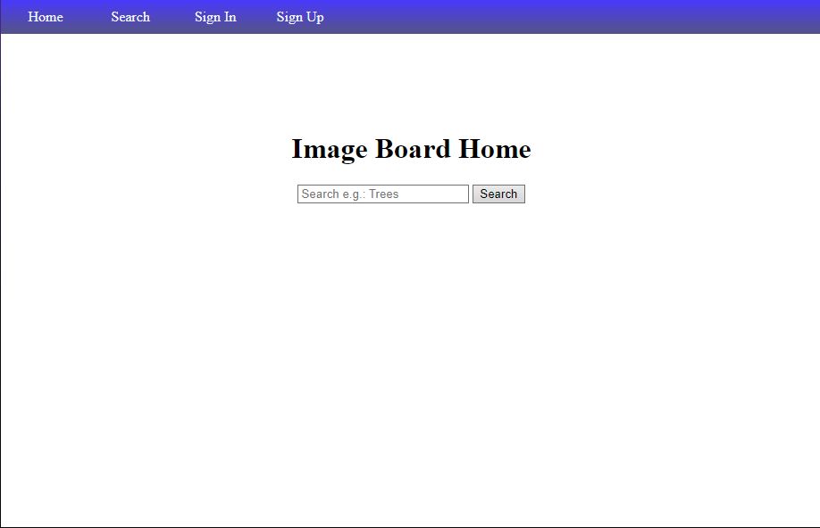

# Image Board

## Preamble
For project 2 of General Assembly, the goal was to make a fully deployed site with CRUD functionality, interacting with a real external database. I've had a personal project that I've wanted to do which is fundamentally a bit similar to an Image board, so I chose this project as a way to work towards my own goals which I already have motivation for.

## Getting Started:

The url for the project can be found [here](https://image-gallery-project-84406d5f0abd.herokuapp.com).

## Technologies:
- Javascript
- CSS
- HTML

## Next Steps:
1. Dark mode.
2. More powerful search query functionality.
 - Tag autofill to reduce barrier to entry and typos.
 - Filters such as upload date.
 - Tokenize search queries so something like "tree" and "trees" would work the same.
3. Search result sorting.
 - Sort by relevance.
4. Standardize "Unknown" uploader to not act like a regular uploader tag which can be searched.
